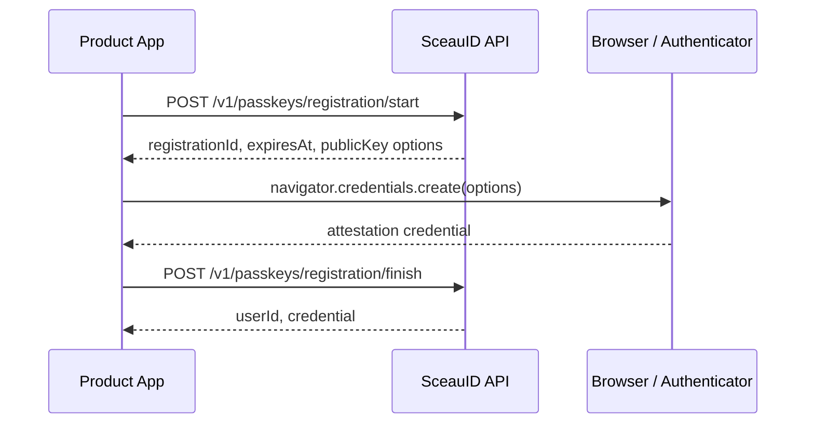
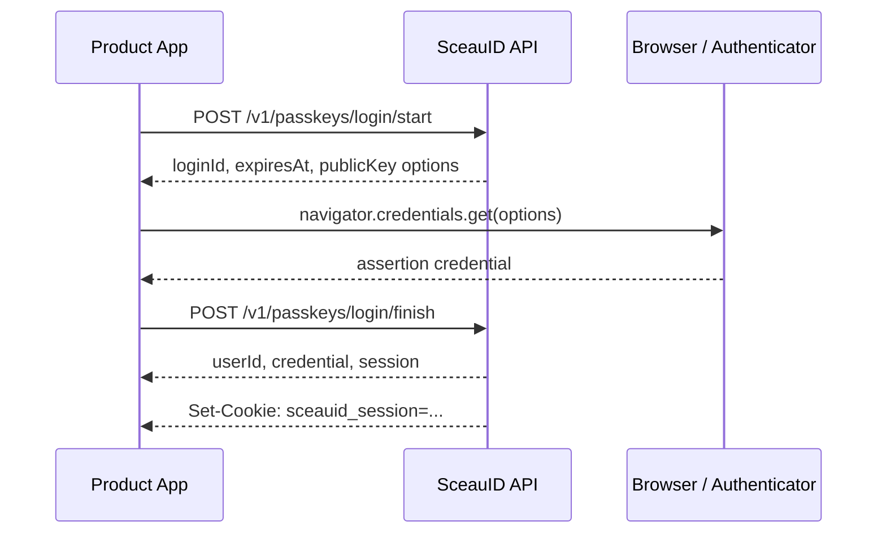

# Passkey API

SceauID exposes passkey registration and login as explicit two-step ceremonies:

1. Start the ceremony and receive WebAuthn public options.
2. Ask the browser or native platform authenticator to create or get a credential.
3. Finish the ceremony by sending the authenticator result back to SceauID.

The API owns challenge storage, credential verification, session creation, and security event recording. Product applications own the user experience around those steps.

## Registration Flow



### Start Registration

`POST /v1/passkeys/registration/start`

```json
{
  "userId": "user_123",
  "userName": "ibukunoluwa@example.com",
  "userDisplayName": "Ibukunoluwa Kehinde"
}
```

Response:

```json
{
  "registrationId": "registration_123",
  "expiresAt": "2026-06-04T12:05:00.000Z",
  "options": {}
}
```

`options` is the public key credential creation payload that should be passed to the browser after converting WebAuthn binary fields into the format expected by the client runtime.

### Finish Registration

`POST /v1/passkeys/registration/finish`

```json
{
  "registrationId": "registration_123",
  "credential": {
    "id": "credential_public_id",
    "rawId": "credential_raw_id",
    "response": {
      "clientDataJSON": "base64url_client_data",
      "attestationObject": "base64url_attestation_object"
    },
    "clientExtensionResults": {},
    "type": "public-key"
  },
  "deviceName": "MacBook Pro"
}
```

Response:

```json
{
  "userId": "user_123",
  "credential": {
    "id": "passkey_123",
    "credentialId": "credential_public_id",
    "deviceName": "MacBook Pro",
    "createdAt": "2026-06-04T12:00:00.000Z"
  }
}
```

## Login Flow



### Start Login

`POST /v1/passkeys/login/start`

For account-scoped login:

```json
{
  "userId": "user_123"
}
```

For discoverable credential login, send an empty object:

```json
{}
```

Response:

```json
{
  "loginId": "login_123",
  "expiresAt": "2026-06-04T12:05:00.000Z",
  "options": {}
}
```

### Finish Login

`POST /v1/passkeys/login/finish`

```json
{
  "loginId": "login_123",
  "credential": {
    "id": "credential_public_id",
    "rawId": "credential_raw_id",
    "response": {
      "clientDataJSON": "base64url_client_data",
      "authenticatorData": "base64url_authenticator_data",
      "signature": "base64url_signature",
      "userHandle": "base64url_user_handle"
    },
    "clientExtensionResults": {},
    "type": "public-key"
  },
  "deviceLabel": "Safari on macOS"
}
```

Response:

```json
{
  "userId": "user_123",
  "credential": {
    "id": "passkey_123",
    "credentialId": "credential_public_id",
    "signCount": 8,
    "lastUsedAt": "2026-06-04T12:00:00.000Z"
  },
  "session": {
    "id": "session_123",
    "token": "session_token",
    "expiresAt": "2026-07-04T12:00:00.000Z"
  }
}
```

On successful login, the API also sets an HTTP-only session cookie. The cookie name is configured with `SESSION_COOKIE_NAME`.

The JSON `session.token` is kept for SDKs, native apps, CLIs, and server-side integrations that cannot rely on browser cookies.

## Current Session

`GET /v1/sessions/current`

Browser clients can use this endpoint to authenticate the current request from the HTTP-only session cookie.

Response:

```json
{
  "user": {
    "id": "user_123",
    "displayName": "Ibukunoluwa Kehinde",
    "status": "active"
  },
  "session": {
    "id": "session_123",
    "deviceLabel": "Safari on macOS",
    "userAgent": "Mozilla/5.0",
    "expiresAt": "2026-07-04T12:00:00.000Z",
    "createdAt": "2026-06-04T12:00:00.000Z"
  }
}
```

Missing, expired, revoked, or invalid sessions return `401` with `error: "unauthenticated"`.

## Passkey List

`GET /v1/passkeys`

Authenticated clients can list registered passkeys for the current user.

Response:

```json
{
  "passkeys": [
    {
      "id": "passkey_123",
      "credentialId": "credential_public_id",
      "deviceName": "MacBook Pro",
      "signCount": 8,
      "lastUsedAt": "2026-06-04T12:00:00.000Z",
      "createdAt": "2026-06-01T12:00:00.000Z",
      "revokedAt": null
    }
  ]
}
```

The response does not expose credential public keys or other verifier material.

## Session List

`GET /v1/sessions`

Authenticated clients can list sessions for the current user. The response marks the active cookie-backed session with `current: true`.

Response:

```json
{
  "sessions": [
    {
      "id": "session_123",
      "current": true,
      "deviceLabel": "Safari on macOS",
      "userAgent": "Mozilla/5.0",
      "expiresAt": "2026-07-04T12:00:00.000Z",
      "revokedAt": null,
      "createdAt": "2026-06-04T12:00:00.000Z"
    }
  ]
}
```

The response does not expose token hashes or IP hashes.

## Revoke A Session

`DELETE /v1/sessions/:sessionId`

Authenticated clients can revoke a session returned by `GET /v1/sessions`.

Response:

```json
{
  "ok": true
}
```

If the revoked session is the current cookie-backed session, the API also clears the session cookie. Sessions outside the authenticated user are returned as `404` with `error: "session_not_found"`.

## Logout

`DELETE /v1/sessions/current`

This endpoint revokes the current server-side session when the session cookie is valid and clears the session cookie in the response.

Response:

```json
{
  "ok": true
}
```

Logout is idempotent for browser clients. If the request has no active session cookie, the API still clears the cookie and returns success.

## Session Cookie Behavior

The default cookie behavior is:

- `HttpOnly`
- `Path=/`
- `SameSite=Lax`
- `Secure` in production

Failed login attempts do not set a session cookie.

## Error Shape

Client errors use a consistent JSON shape:

```json
{
  "error": "login_finish_failed",
  "message": "Passkey login verification failed"
}
```

Current passkey route error codes:

- `invalid_request`
- `registration_start_failed`
- `registration_finish_failed`
- `login_start_failed`
- `login_finish_failed`

## Security Events

Passkey flows record security events as product data, not only server logs.

Current events include:

- `passkey_registration_started`
- `passkey_registered`
- `passkey_registration_failed`
- `login_started`
- `login_succeeded`
- `login_failed`
- `session_revoked`

Session revocation events include metadata for `reason`, `actorSessionId`, and whether the revoked session was the actor's own session.

### List Security Events

`GET /v1/security-events?limit=50`

Authenticated clients can fetch the current user's security timeline.

Response:

```json
{
  "events": [
    {
      "id": "event_123",
      "userId": "user_123",
      "actorUserId": "user_123",
      "sessionId": "session_123",
      "eventType": "session_revoked",
      "outcome": "success",
      "riskLevel": "low",
      "metadata": {
        "reason": "targeted_revoke"
      },
      "context": {},
      "createdAt": "2026-06-04T12:00:00.000Z"
    }
  ]
}
```

`limit` is optional and must be between `1` and `100`.

These events are intended to support account timelines, user-facing security history, investigation workflows, and future webhook delivery.

## Integration Notes

- Challenge IDs (`registrationId` and `loginId`) are short-lived and single-use.
- WebAuthn binary values should be encoded as base64url strings over HTTP.
- The API validates the relying party ID and origin during finish calls.
- Sessions are server-side records and can be revoked independently of the cookie.
- Browser clients should call the SDK or API with credentials enabled so cookies are sent and received.
