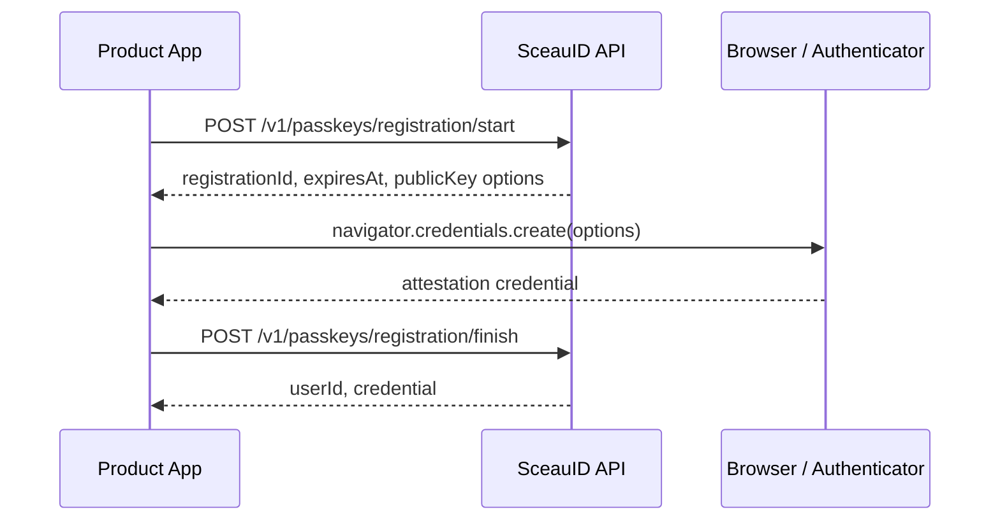
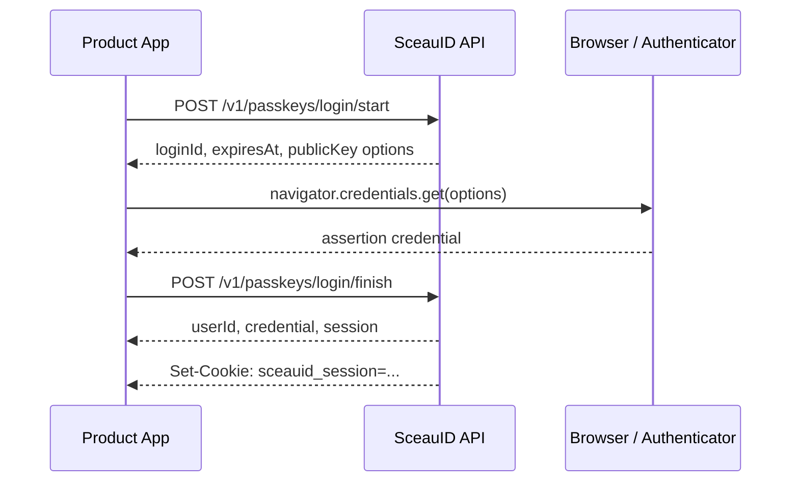

# Passkey API

SceauID exposes passkey registration and login as explicit two-step ceremonies:

1. Start the ceremony and receive WebAuthn public options.
2. Ask the browser or native platform authenticator to create or get a credential.
3. Finish the ceremony by sending the authenticator result back to SceauID.

The API owns challenge storage, credential verification, session creation, and security event recording. Product applications own the user experience around those steps.

## Registration Flow



### Start Registration

`POST /v1/passkeys/registration/start`

```json
{
  "userId": "user_123",
  "userName": "ibukunoluwa@example.com",
  "userDisplayName": "Ibukunoluwa Kehinde"
}
```

Response:

```json
{
  "registrationId": "registration_123",
  "expiresAt": "2026-06-04T12:05:00.000Z",
  "options": {}
}
```

`options` is the public key credential creation payload that should be passed to the browser after converting WebAuthn binary fields into the format expected by the client runtime.

### Finish Registration

`POST /v1/passkeys/registration/finish`

```json
{
  "registrationId": "registration_123",
  "credential": {
    "id": "credential_public_id",
    "rawId": "credential_raw_id",
    "response": {
      "clientDataJSON": "base64url_client_data",
      "attestationObject": "base64url_attestation_object"
    },
    "clientExtensionResults": {},
    "type": "public-key"
  },
  "deviceName": "MacBook Pro"
}
```

Response:

```json
{
  "userId": "user_123",
  "credential": {
    "id": "passkey_123",
    "credentialId": "credential_public_id",
    "deviceName": "MacBook Pro",
    "createdAt": "2026-06-04T12:00:00.000Z"
  }
}
```

## Login Flow



### Start Login

`POST /v1/passkeys/login/start`

For account-scoped login:

```json
{
  "userId": "user_123"
}
```

For discoverable credential login, send an empty object:

```json
{}
```

Response:

```json
{
  "loginId": "login_123",
  "expiresAt": "2026-06-04T12:05:00.000Z",
  "options": {}
}
```

### Finish Login

`POST /v1/passkeys/login/finish`

```json
{
  "loginId": "login_123",
  "credential": {
    "id": "credential_public_id",
    "rawId": "credential_raw_id",
    "response": {
      "clientDataJSON": "base64url_client_data",
      "authenticatorData": "base64url_authenticator_data",
      "signature": "base64url_signature",
      "userHandle": "base64url_user_handle"
    },
    "clientExtensionResults": {},
    "type": "public-key"
  },
  "deviceLabel": "Safari on macOS"
}
```

Response:

```json
{
  "userId": "user_123",
  "credential": {
    "id": "passkey_123",
    "credentialId": "credential_public_id",
    "signCount": 8,
    "lastUsedAt": "2026-06-04T12:00:00.000Z"
  },
  "session": {
    "id": "session_123",
    "token": "session_token",
    "expiresAt": "2026-07-04T12:00:00.000Z"
  }
}
```

On successful login, the API also sets an HTTP-only session cookie. The cookie name is configured with `SESSION_COOKIE_NAME`.

The JSON `session.token` is kept for SDKs, native apps, CLIs, and server-side integrations that cannot rely on browser cookies.

## Current Session

`GET /v1/sessions/current`

Browser clients can use this endpoint to authenticate the current request from the HTTP-only session cookie.

Response:

```json
{
  "user": {
    "id": "user_123",
    "displayName": "Ibukunoluwa Kehinde",
    "status": "active"
  },
  "session": {
    "id": "session_123",
    "kind": "standard",
    "deviceLabel": "Safari on macOS",
    "userAgent": "Mozilla/5.0",
    "expiresAt": "2026-07-04T12:00:00.000Z",
    "authenticatedAt": "2026-06-04T11:55:00.000Z",
    "createdAt": "2026-06-04T12:00:00.000Z"
  }
}
```

Missing, expired, revoked, or invalid sessions return `401` with `error: "unauthenticated"`.

## Passkey List

`GET /v1/passkeys`

Authenticated clients can list registered passkeys for the current user.

Response:

```json
{
  "passkeys": [
    {
      "id": "passkey_123",
      "credentialId": "credential_public_id",
      "deviceName": "MacBook Pro",
      "signCount": 8,
      "lastUsedAt": "2026-06-04T12:00:00.000Z",
      "createdAt": "2026-06-01T12:00:00.000Z",
      "revokedAt": null
    }
  ]
}
```

The response does not expose credential public keys or other verifier material.

## Revoke A Passkey

`DELETE /v1/passkeys/:passkeyId`

Authenticated clients can revoke a passkey returned by `GET /v1/passkeys`.

This endpoint requires recent authentication. Sessions outside the fresh-auth window return `403` with `error: "fresh_auth_required"`.

Response:

```json
{
  "ok": true
}
```

Passkeys outside the authenticated user are returned as `404` with `error: "passkey_not_found"`.

Revoking the final active passkey is rejected as `409` with `error: "last_passkey_required"`.

## Recovery Codes

Recovery codes give an authenticated user a fallback they can store offline before they lose access to their passkeys.

### Recovery Code Status

`GET /v1/recovery/status`

Response:

```json
{
  "recoveryCodesConfigured": true,
  "unusedRecoveryCodeCount": 10
}
```

The status endpoint never returns code values.

### Enroll Recovery Codes

`POST /v1/recovery/codes`

Enrollment requires recent authentication. Sessions outside the fresh-auth window return `403` with `error: "fresh_auth_required"`.

Response:

```json
{
  "codes": ["ABCDE-FGHIJ-KLMNO-PQRST"],
  "recoveryCodesConfigured": true,
  "unusedRecoveryCodeCount": 10
}
```

Enrollment returns the plain recovery codes once. Existing unused recovery codes for the user are invalidated before the new set is stored. SceauID stores code hashes only, so product applications should ask users to copy or download the returned codes immediately.

### Redeem Recovery Code

`POST /v1/recovery/codes/redeem`

```json
{
  "userId": "user_123",
  "code": "ABCDE-FGHIJ-KLMNO-PQRST"
}
```

Response:

```json
{
  "ok": true,
  "recoveryRequest": {
    "id": "recovery_request_123",
    "expiresAt": "2026-06-01T12:15:00.000Z",
    "riskLevel": "medium"
  }
}
```

Redemption does not require an active session. The API normalizes and hashes the submitted code, atomically marks a matching unused code as used, and creates a short-lived pending recovery request. Invalid, already used, or unknown user/code pairs return `401` with `error: "invalid_recovery_code"`. Too many redemption attempts for the same user return `429` with `error: "rate_limited"` before any recovery code is consumed.

### Recovery Request Status

`GET /v1/recovery/requests/:recoveryRequestId`

Response:

```json
{
  "recoveryRequest": {
    "id": "recovery_request_123",
    "active": true,
    "expiresAt": "2026-06-01T12:15:00.000Z",
    "riskLevel": "medium",
    "status": "pending"
  }
}
```

Pending requests are reported as `expired` and `active: false` after their expiry time. Unknown request IDs return `404` with `error: "recovery_request_not_found"`.

### Cancel Recovery Request

`DELETE /v1/recovery/requests/:recoveryRequestId`

Pending and unexpired recovery requests can be cancelled before completion.

Response:

```json
{
  "ok": true,
  "recoveryRequest": {
    "id": "recovery_request_123",
    "cancelledAt": "2026-06-01T12:02:00.000Z",
    "status": "cancelled"
  }
}
```

Unknown requests return `404` with `error: "recovery_request_not_found"`. Expired requests return `409` with `error: "recovery_request_expired"`. Requests that are already completed, verified, cancelled, or otherwise no longer pending return `409` with `error: "recovery_request_not_pending"`.

### Complete Recovery Request

`POST /v1/recovery/requests/:recoveryRequestId/complete`

Response:

```json
{
  "ok": true,
  "recoverySession": {
    "id": "session_123",
    "token": "recovery_session_token",
    "expiresAt": "2026-06-01T12:16:00.000Z"
  },
  "recoveryRequest": {
    "id": "recovery_request_123",
    "completedAt": "2026-06-01T12:01:00.000Z",
    "status": "completed"
  }
}
```

Only pending and unexpired recovery requests can be completed. Unknown requests return `404` with `error: "recovery_request_not_found"`. Expired requests return `409` with `error: "recovery_request_expired"`. Requests that are already completed, verified, cancelled, or otherwise no longer pending return `409` with `error: "recovery_request_not_pending"`.

The recovery session token is short-lived and gives the product application a bounded handoff credential for the next recovery step, such as passkey re-enrollment.

### Start Recovery Passkey Registration

`POST /v1/recovery/passkeys/registration/start`

```json
{
  "recoverySessionToken": "recovery_session_token",
  "userName": "ibukunoluwa@example.com",
  "userDisplayName": "Ibukunoluwa Kehinde"
}
```

Response:

```json
{
  "registrationId": "registration_123",
  "expiresAt": "2026-06-01T12:05:00.000Z",
  "options": {}
}
```

The recovery session token must come from a completed recovery request. Product applications should pass `options` to the authenticator, then finish the ceremony with `POST /v1/passkeys/registration/finish`.

Recovery-started registrations are tagged in passkey registration security events with recovery context, including the recovery session ID.

Too many passkey registration starts for the same recovery session return `429` with `error: "rate_limited"` before a new ceremony is created. SceauID records the block as `rate_limit_triggered` with `scope: "recovery_passkey_registration_start"`.

After a recovery-started passkey registration finishes successfully, SceauID revokes the short-lived recovery session and records the revocation reason as `recovery_passkey_registered`.

## Session List

`GET /v1/sessions`

Authenticated clients can list sessions for the current user. The response marks the active cookie-backed session with `current: true`.

Response:

```json
{
  "sessions": [
    {
      "id": "session_123",
      "current": true,
      "kind": "standard",
      "deviceLabel": "Safari on macOS",
      "userAgent": "Mozilla/5.0",
      "expiresAt": "2026-07-04T12:00:00.000Z",
      "revokedAt": null,
      "authenticatedAt": "2026-06-04T11:55:00.000Z",
      "createdAt": "2026-06-04T12:00:00.000Z"
    },
    {
      "id": "recovery_session_123",
      "current": false,
      "kind": "recovery",
      "deviceLabel": "Recovery session",
      "userAgent": null,
      "expiresAt": "2026-06-04T12:15:00.000Z",
      "revokedAt": null,
      "authenticatedAt": "2026-06-04T12:00:00.000Z",
      "createdAt": "2026-06-04T12:00:00.000Z"
    }
  ]
}
```

The response does not expose token hashes or IP hashes. Recovery sessions are short-lived handoff sessions and are marked with `kind: "recovery"`.

Recovery sessions are rejected by normal authenticated endpoints with `403` and `error: "standard_session_required"`. They are only accepted by recovery handoff endpoints that explicitly ask for a recovery session token.

Use the stale identity maintenance command described in `docs/operations/stale-identity-maintenance.md` to delete expired or revoked session records outside the configured retention window.

## Revoke A Session

`DELETE /v1/sessions/:sessionId`

Authenticated clients can revoke a session returned by `GET /v1/sessions`.

Revoking another session requires recent authentication. Sessions outside the fresh-auth window return `403` with `error: "fresh_auth_required"`. Current-session logout through `DELETE /v1/sessions/current` remains available without a fresh-auth check so users can always end their own session.

Response:

```json
{
  "ok": true
}
```

If the revoked session is the current cookie-backed session, the API also clears the session cookie. Sessions outside the authenticated user are returned as `404` with `error: "session_not_found"`.

## Logout

`DELETE /v1/sessions/current`

This endpoint revokes the current server-side session when the session cookie is valid and clears the session cookie in the response.

Response:

```json
{
  "ok": true
}
```

Logout is idempotent for browser clients. If the request has no active session cookie, the API still clears the cookie and returns success.

## Session Cookie Behavior

The default cookie behavior is:

- `HttpOnly`
- `Path=/`
- `SameSite=Lax`
- `Secure` in production

Failed login attempts do not set a session cookie.

## Error Shape

Client errors use a consistent JSON shape:

```json
{
  "error": "login_finish_failed",
  "message": "Passkey login verification failed"
}
```

Current passkey route error codes:

- `invalid_request`
- `fresh_auth_required`
- `last_passkey_required`
- `registration_start_failed`
- `registration_finish_failed`
- `login_start_failed`
- `login_finish_failed`
- `unauthenticated`
- `standard_session_required`
- `invalid_recovery_session`
- `invalid_recovery_code`
- `rate_limited`
- `recovery_request_expired`
- `recovery_request_not_found`
- `recovery_request_not_pending`
- `security_event_not_found`

## Security Events

Passkey flows record security events as product data, not only server logs.

Current events include:

- `passkey_registration_started`
- `passkey_registered`
- `passkey_registration_failed`
- `login_started`
- `login_succeeded`
- `login_failed`
- `passkey_removed`
- `session_created`
- `session_revoked`
- `recovery_codes_enrolled`
- `recovery_code_redeemed`
- `recovery_started`
- `recovery_verified`
- `recovery_completed`
- `recovery_cancelled`
- `recovery_delayed`
- `rate_limit_triggered`

Passkey removal events include metadata for `passkeyId`, `deviceName`, `actorSessionId`, and `revokedAt`.

Session creation events include metadata for `loginId`, `credentialId`, `passkeyId`, `deviceLabel`, `userAgent`, `ipHashPresent`, and `expiresAt`.

Session revocation events include metadata for `reason`, `actorSessionId`, whether the revoked session was the actor's own session, and target session device/timing fields.

Passkey ceremony, passkey removal, session revocation, and recovery-code redemption events include request context when available: `traceId`, `userAgent`, and hashed `ipHash`. Raw client IP addresses are not stored in the security-event context.

Recovery code enrollment events include metadata for `codeCount` and `enrolledAt`. Recovery code redemption events include metadata for `redeemedAt` and use medium risk.

Recovery redemption rate-limit events use `rate_limit_triggered` with metadata for `scope`, `limit`, `remaining`, `windowSeconds`, and `resetAt`.

Failed recovery code redemption attempts record `recovery_code_redeemed` with `outcome: "failure"` and metadata for `scope`, `reason`, and `attemptedAt`. Invalid recovery session use during passkey re-enrollment records `suspicious_activity_flagged` with recovery scope metadata.

### List Recovery Events

`GET /v1/recovery/events?limit=50&outcome=success&riskLevel=medium&actorUserId=user_123&sessionId=session_123&traceId=req_abc123&createdAfter=2026-06-01T00:00:00.000Z&createdBefore=2026-06-02T00:00:00.000Z&cursor=next_page_token`

Authenticated clients can fetch the current user's recovery-focused security timeline without manually selecting recovery event types.

The response shape matches `GET /v1/security-events`. `limit`, `cursor`, `actorUserId`, `sessionId`, `traceId`, `outcome`, `riskLevel`, `createdAfter`, and `createdBefore` use the same rules as the general security event list.

### List Security Events

`GET /v1/security-events?limit=50&eventType=login_failed&outcome=failure&riskLevel=medium&actorUserId=user_123&sessionId=session_123&traceId=req_abc123&createdAfter=2026-06-01T00:00:00.000Z&createdBefore=2026-06-02T00:00:00.000Z&cursor=next_page_token`

Authenticated clients can fetch the current user's security timeline.

Response:

```json
{
  "events": [
    {
      "id": "event_123",
      "userId": "user_123",
      "actorUserId": "user_123",
      "sessionId": "session_123",
      "eventType": "session_revoked",
      "outcome": "success",
      "riskLevel": "low",
      "metadata": {
        "reason": "targeted_revoke"
      },
      "context": {},
      "createdAt": "2026-06-04T12:00:00.000Z"
    }
  ],
  "nextCursor": "next_page_token"
}
```

`limit` is optional and must be between `1` and `100`.

`cursor` is optional. Use the previous response's `nextCursor` to fetch the next page. `nextCursor` is `null` when there are no more events.

`eventType` is optional and can be provided more than once or as a comma-separated list.

`outcome` and `riskLevel` are optional filters and follow the same repeated or comma-separated format.

`actorUserId`, `sessionId`, and `traceId` are optional exact-match filters. Use them to review activity performed by a specific actor, tied to a specific session, or correlated with a request ID.

`createdAfter` and `createdBefore` are optional inclusive ISO timestamp filters. Use them to fetch an investigation window without scanning the full security timeline.

### Get Security Event

`GET /v1/security-events/:eventId`

Authenticated clients can fetch one security event from the current user's timeline.

Response:

```json
{
  "event": {
    "id": "event_123",
    "userId": "user_123",
    "actorUserId": "user_123",
    "sessionId": "session_123",
    "eventType": "session_revoked",
    "outcome": "success",
    "riskLevel": "low",
    "metadata": {
      "reason": "targeted_revoke"
    },
    "context": {},
    "createdAt": "2026-06-04T12:00:00.000Z"
  }
}
```

Events outside the authenticated user are returned as `404` with `error: "security_event_not_found"`.

These events are intended to support account timelines, user-facing security history, investigation workflows, and future webhook delivery.

Use the security-event retention prune command described in `docs/operations/security-event-retention.md` to delete events outside the configured retention window.

## Integration Notes

- Challenge IDs (`registrationId` and `loginId`) are short-lived and single-use.
- WebAuthn binary values should be encoded as base64url strings over HTTP.
- The API validates the relying party ID and origin during finish calls.
- Sessions are server-side records and can be revoked independently of the cookie.
- Expired sessions and stale recovery requests should be pruned with the stale identity maintenance command.
- Browser clients should call the SDK or API with credentials enabled so cookies are sent and received.
