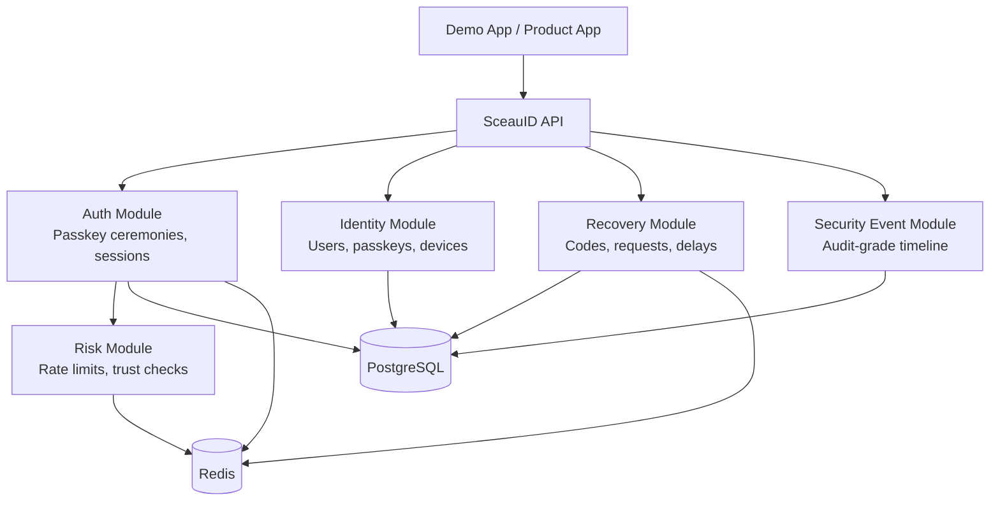

# Architecture Overview

SceauID starts as a modular monolith. The goal is clear identity boundaries without introducing distributed-system complexity too early.

## Boundary Decisions

- PostgreSQL stores durable identity state.
- Redis stores short-lived state such as challenges and rate limits.
- Security events are product data, not only logs.
- Sessions are server-side records so they can be inspected and revoked.
- Passkey flows are primary auth flows, not optional MFA decoration.
